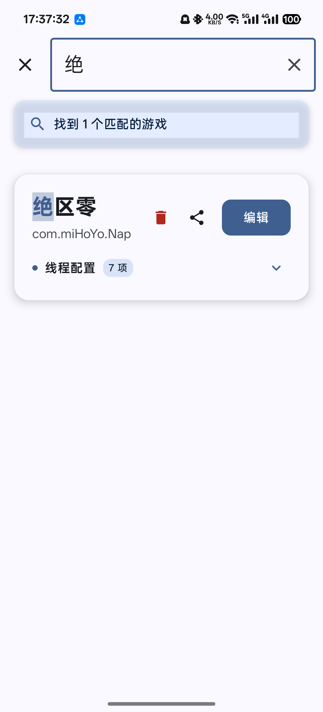
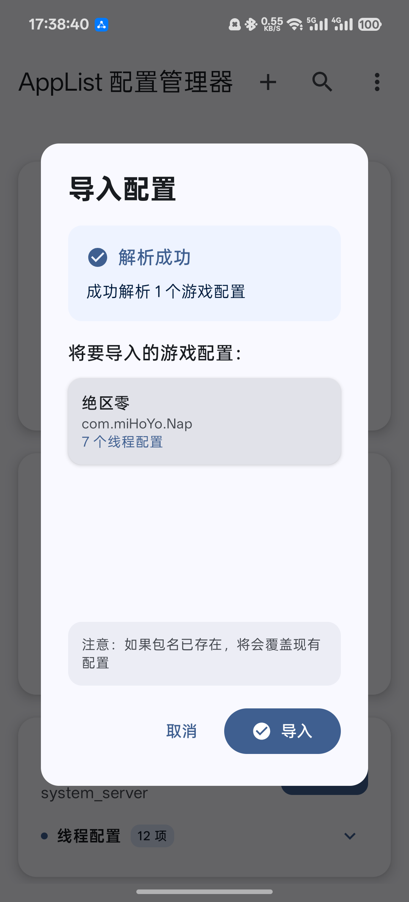
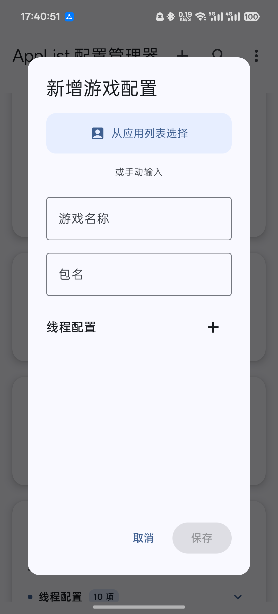

# ThreadUI - 游戏线程配置管理器


ThreadUI 是一个现代化的 Android 应用程序，专为管理 `/data/adb/modules/AppOpt/applist.conf` 游戏优化配置文件而设计。采用 Material 3 设计语言和 Jetpack Compose 技术栈，提供直观友好的用户界面来查看、编辑和管理游戏的 CPU 线程配置。

## ✨ 主要特性

### 🎮 配置管理
- **智能解析**: 自动解析 applist.conf 配置文件
- **可视化编辑**: 通过直观的卡片界面管理游戏配置
- **实时预览**: 即时显示配置修改效果
- **一键保存**: 快速将配置保存到系统文件

### 🔍 强大的搜索功能
- **实时搜索**: 支持游戏名称和包名的实时过滤
- **搜索高亮**: 在搜索结果中高亮显示匹配关键词
- **快捷标签**: 预设的开发商和游戏类型标签
- **智能统计**: 显示搜索结果数量和状态

### 📱 现代化界面
- **折叠设计**: 线程配置默认折叠，保持界面简洁
- **平滑动画**: 流畅的展开/收起动画效果
- **Material 3**: 采用最新的 Material Design 3 设计语言
- **深色主题**: 完整支持系统深色模式

### 🚀 完整的 CRUD 操作
- **新增游戏**: 添加新的游戏配置
- **编辑配置**: 修改游戏信息和线程设置
- **删除管理**: 单个删除和批量删除功能
- **配置导入导出**: 分享和导入配置文件

### 🔄 配置分享系统
- **单个分享**: 分享特定游戏的配置
- **批量分享**: 选择性分享多个游戏配置
- **智能导入**: 支持 JSON 格式配置文件导入
- **覆盖保护**: 导入时自动处理重复包名

### 🛡️ 安全特性
- **Root 检测**: 智能检测设备 Root 状态
- **权限管理**: 安全的文件操作权限控制
- **模块验证**: 验证 AppOpt 模块安装状态
- **操作确认**: 关键操作需要用户确认

## 🎯 界面预览




### 主界面特性
- **紧凑卡片**: 游戏信息以折叠卡片形式展示
- **操作按钮**: 删除、分享、编辑按钮一目了然
- **状态指示**: 清晰的线程配置数量显示
- **渠道标识**: 自动识别并标记渠道服游戏

### 菜单功能
- **配置导入**: 从文件导入游戏配置
- **批量分享**: 选择性分享多个配置
- **批量删除**: 选择性删除多个配置
- **系统操作**: 刷新和保存功能

## 📋 系统要求

- **操作系统**: Android 14+ (API Level 35)
- **权限要求**: Root 权限
- **存储权限**: 读写外部存储权限
- **模块依赖**: AppOpt 线程优化模块
- **架构支持**: ARM64, ARMv7

## 🚀 安装使用

### 前置条件
1. 设备已获取 Root 权限
2. 已安装 Magisk 框架
3. 已安装 AppOpt 线程优化模块
4. 重启设备并激活模块

### 安装步骤
1. 下载最新版本的 `ThreadUI-1.0.0.apk`
2. 启用"未知来源"安装权限
3. 安装应用程序
4. 授予必要的系统权限
5. 启动应用并检查 Root 状态

### 首次使用
1. **权限检查**: 应用启动时自动检测 Root 权限
2. **模块验证**: 确认 AppOpt 模块已正确安装
3. **加载配置**: 点击刷新按钮加载现有配置
4. **开始使用**: 浏览、编辑和管理游戏配置

## 📖 使用指南

### 基本操作

#### 浏览配置
- 应用启动后显示所有游戏配置卡片
- 默认折叠状态，点击可展开查看详细信息
- 每个卡片显示游戏名称、包名和配置数量

#### 搜索游戏
1. 点击搜索图标进入搜索模式
2. 输入游戏名称或包名关键词
3. 查看实时过滤结果和高亮显示
4. 使用快捷标签进行快速筛选

#### 编辑配置
1. 点击游戏卡片上的"编辑"按钮
2. 在对话框中修改游戏名称和包名
3. 添加、编辑或删除线程配置
4. 点击"保存"应用更改

#### 新增游戏
1. 点击顶部"+"按钮
2. 输入游戏名称和包名
3. 添加一个或多个线程配置
4. 保存新游戏配置

### 高级功能

#### 配置分享
**单个分享**:
- 点击游戏卡片上的分享图标
- 选择分享方式（文件、聊天应用等）
- 接收方可直接导入配置

**批量分享**:
1. 点击菜单中的"批量分享"
2. 选择要分享的游戏（支持全选）
3. 确认分享，生成 JSON 配置文件

#### 配置导入
1. 点击菜单中的"导入配置"
2. 选择 JSON 配置文件
3. 预览要导入的配置信息
4. 确认导入（重复包名将被覆盖）

#### 删除管理
**单个删除**:
- 点击游戏卡片上的删除图标
- 确认删除操作

**批量删除**:
1. 点击菜单中的"批量删除"
2. 选择要删除的游戏
3. 确认批量删除操作

## 🔧 配置文件格式

ThreadUI 支持标准的 applist.conf 格式：

```conf
#游戏名称
包名{线程名}=CPU核心
包名=CPU核心

#王者荣耀
com.tencent.tmgp.sgame{UnityMain}=7
com.tencent.tmgp.sgame{UnityGfxDeviceW}=2-4
com.tencent.tmgp.sgame=2-6

#和平精英
com.tencent.tmgp.pubgmhd{UnityMain}=7
com.tencent.tmgp.pubgmhd{UnityGfxDeviceW}=2-4
com.tencent.tmgp.pubgmhd=0-7
```

### 分享文件格式
分享功能使用 JSON 格式：

```json
{
  "version": "1.0",
  "exportTime": 1699123456789,
  "games": [
    {
      "name": "王者荣耀",
      "packageName": "com.tencent.tmgp.sgame",
      "threadConfigs": [
        {
          "threadName": "UnityMain",
          "cpuCores": "7"
        },
        {
          "threadName": "UnityGfxDeviceW", 
          "cpuCores": "2-4"
        },
        {
          "threadName": "主进程",
          "cpuCores": "2-6"
        }
      ]
    }
  ]
}
```

## 🛠️ 开发构建

### 开发环境
- **IDE**: Android Studio Hedgehog | 2023.1.1+
- **Kotlin**: 2.0.21
- **Compose**: 2024.09.00
- **Gradle**: 8.11.0
- **Target SDK**: 36 (Android 14)

### 构建命令

```bash
# 克隆项目
git clone https://github.com/your-repo/ThreadUI.git
cd ThreadUI

# 构建 Debug 版本
./gradlew assembleDebug

# 构建 Release 版本  
./gradlew assembleRelease

# 运行单元测试
./gradlew test

# 运行设备测试
./gradlew connectedAndroidTest

# 清理项目
./gradlew clean

# 安装到设备
./gradlew installDebug
```

### 输出文件
- **Debug**: `app/build/outputs/apk/debug/ThreadUI-1.0.0-debug.apk`
- **Release**: `app/build/outputs/apk/release/ThreadUI-1.0.0-release.apk`

### 项目结构
```
app/src/main/java/com/reddoctor/treadui/
├── MainActivity.kt                 # 主活动和UI
├── data/
│   ├── GameConfig.kt              # 数据模型
│   └── ShareConfig.kt             # 分享数据模型
├── ui/
│   ├── components/                # UI组件
│   │   ├── GameEditDialog.kt      # 编辑对话框
│   │   └── ShareImportDialogs.kt  # 分享导入对话框
│   └── theme/                     # 主题配置
└── utils/
    ├── RootUtils.kt               # Root工具类
    ├── ShareUtils.kt              # 分享工具类
    └── ImportUtils.kt             # 导入工具类
```

## 🔒 权限说明

| 权限 | 用途 | 必需性 |
|------|------|---------|
| `WRITE_EXTERNAL_STORAGE` | 写入配置文件 | 必需 |
| `READ_EXTERNAL_STORAGE` | 读取配置文件 | 必需 |
| `MANAGE_EXTERNAL_STORAGE` | Android 11+ 存储访问 | 必需 |
| Root 权限 | 访问系统保护目录 | 必需 |

## ⚠️ 注意事项

### 使用须知
1. **备份重要**: 修改前请备份原始配置文件
2. **谨慎操作**: 错误的配置可能影响游戏性能
3. **权限安全**: 仅授予应用必要的系统权限
4. **模块依赖**: 确保 AppOpt 模块正确安装并激活

### 兼容性
- 支持主流 Android 设备和 ROM
- 兼容不同版本的 AppOpt 模块
- 支持多种 CPU 架构配置
- 适配不同屏幕尺寸和分辨率

### 故障排除
**应用无法启动**:
- 检查设备 Root 状态
- 确认 Android 版本 >= 14
- 重新安装应用

**无法读取配置**:
- 检查 AppOpt 模块安装
- 确认模块已重启激活
- 检查文件路径权限

**保存失败**:
- 确认 Root 权限已授予
- 检查存储空间是否充足
- 重启应用重试操作

## 🤝 贡献指南

欢迎提交 Issue 和 Pull Request 来改进 ThreadUI！

### 开发规范
- 遵循 Kotlin 编码规范
- 使用 Material 3 设计原则
- 编写单元测试覆盖核心功能
- 提交前运行完整测试套件

### 问题反馈
请在 [Issues](https://github.com/reddoctor/ThreadUI/issues) 页面提交：
- 详细的问题描述
- 设备信息和系统版本
- 复现步骤和截图
- 期望的解决方案

## 📄 许可证

本项目仅用于学习和研究目的。请勿用于商业用途或恶意行为。
